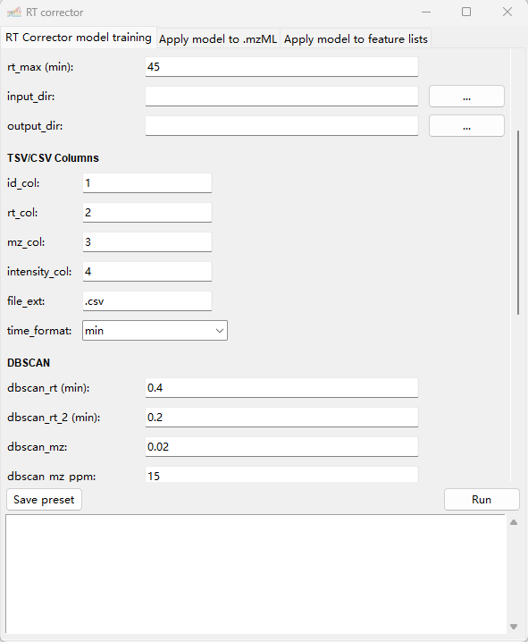

# RT Corrector


## Overview
RT Corrector is a Python tool designed to correct complex retention time (RT) shifts in LC-/GC-MS-based ’omics analyses, enabling consistent and comparable feature RTs for downstream data processing and interpretation.

RT Corrector contains **three modules**:

1. **Model training**  
- Train RT correction models (warping curves) for each sample using feature/peak lists.

2. **Correct feature lists**
- Trained models are applied to feature lists in **.csv** / **.tsv** format.

3. **Correct mzML files**  
- Trained models are directly applied to raw LC-/GC-MS data stored in the standardized **.mzML** format.

Direct RT correction at the raw data level provides high flexibility and allows integration with diverse analytical platforms and downstream software tools.

RT Corrector is distributed with a Windows **.exe** graphical user interface (GUI), the same functionality is also available in command-line mode.

For XCMS users (in R), we additionally provide scripts to export feature lists and to directly apply trained RT correction models to **XCMSnExp** object.
   
---

## Installation
Python >= 3.10 is required

Dependency installation:
```
pip install -r requirements.txt
```

For Windows users, a .exe GUI is available in the release and can be used without installation.

---
## Usage: Command Line mode

## Module 1: RT Corrector Model Training:
```
python mzml_model_trainer.py [parameters]
```
### Inputs files
- **.csv/.tsv** formatted feature/peak lists files (See example. To be noticed, individual feature lists for each sample are required, instead of aligned feature lists)
- For most analytical platforms, feature/peak lists can be directly exported using embedded tools
- For XCMS >= 4.8 (R) users, **RT_Corrector_XCMS.R**  script is recommended for feature/peak list exportation

example:
```
...load XCMS/other packages...
source("RT_Corrector_XCMS.R")

xdata <- readMSData(...)
xdata <- findChromPeaks(...)

export_feature_lists(
  xdata,
  outdir = "Path for export",
  suffix = ".csv"
)
...downstream analysis...
```

### Outputs
- Correction curves figures
- RT shift matrix plots
- Intermediate files
- Trained model file: **rt_correction_models.pkl**

### Parameters
**Basic settings**
| Parameter | Type | Description |
|---------|------|-------------|
| --input_dir | str (path) | Directory containing feature lists |
| --output_dir | str (path) | Output directory |
| --datatype | str | csv / tsv / msdial (default: tsv) |
| --calculate_summary_data | bool | true / false (default: false) |
| --min_peak | float | Minimum features intensity/area to be involved (default: 5000) |
| --rt_max | float | Maximum RT (mins) (default: 45) |

**Feature list load setting (for csv / tsv)**
| Parameter | Type | Description |
|---------|------|-------------|
| --id_col | int | Feature ID column (start from 0) |
| --rt_col | int | RT column |
| --mz_col | int | m/z column |
| --intensity_col | int | Intensity column |
| --file_suffix | str | File suffix |
| --time_format | str | min / sec |

**DBSCAN parameters setting**
| Parameter | Type | Description |
|---------|------|-------------|
| --dbscan_rt | float | RT tolerance for 1st round correction (min) (default: 0.4) |
| --dbscan_rt2 | float | RT tolerance for 2nd round correction (min) (default: 0.2) |
| --dbscan_mz | float | m/z tolerance, absolute (default: 0.02)|
| --dbscan_mz_ppm | float | m/z tolerance, ppm (default: 15) |

**Feature filter setting**
| Parameter | Type | Description |
|---------|------|-------------|
| --linear_fit | bool | Enables linear regression of feature RT as a function of sample order. Features with linear coefficient r lower than given threshold will be filtered. Recommended for one batch dataset where shows continuous RT shift along the sequence (default: False) |
| --linear_r | float | r threshold for linear fit. From 0-1 (default: 0.6) |
| --max_rt_diff | float | Maximum RT shift expected, compared to medium value (default: 0.5) |
| --min_sample | int | Minimum number of samples in which a feature should be present (default: 10) |
| --min_sample2 | int | Minimum number of samples in which a feature should be present. For edge RT regions with fewer features (default: 5) |
| --min_feature_group | int | Minimum features per sample (default: 5) |
| --rt_bins | int | Number of rt bins used for grouping features (default: 500) |

**LOESS fit setting**
| Parameter | Type | Description |
|---------|------|-------------|
| --it | int | Number of lowess iterations (default: 3) |
| --loess_frac | float | Smoothing fraction, 0–1 (default: 0.1) |

**Interpolation setting**
| Parameter | Type | Description |
|---------|------|-------------|
| --interpolate_f | float | Interpolation strictness, 0–1 (default: 0.6) |

**Save and load preset configuration**
| Parameter | Type | Description |
|---------|------|-------------|
| --create_preset | str | Create preset (name) and exit |
| --config | str | Load preset (name) |

## Module 2: Correct Feature Lists
```
python apply_model_featurelist.py [parameters]
```

### Basic settings
| Parameter | Type | Description |
|--------|------|------------|
| --featurelist_dir | str (path) | Directory containing feature list files |
| --model_path | str (path) | Path to trained RT model (.pkl) |
| --output_dir | str (path) | Output directory for corrected feature lists |

### Feature list settings

| Parameter | Type | Description |
|--------|------|------------|
| --rt_columns | str | RT column name(s); comma-separated if multiple |
| --input_suffix | str | Suffix of feature list files |
| --model_suffix | str | Suffix used in model training feature lists |
| --rt_unit | str | RT unit: `min` or `sec` (default: min)|

### Processing options

| Parameter | Type | Description |
|--------|------|------------|
| --overwrite_original | bool | Overwrite original RT values if true (default: true) |
| --n_workers | int | Number of CPU processors (default: cpu_count-1) |
| --round_digits | int | Number of decimal digits to keep in RT (default: 4) |

## Module 3: Apply RT Model to mzML Files

```
python mzml_correction.py [parameters]
```
### Basic settings

| Parameter | Type | Description |
|--------|------|------------|
| --mzml_dir | str (path) | Directory containing mzML files |
| --out_dir | str (path) | Output directory for corrected mzML files |
| --model_path | str (path) | Path to trained RT model (.pkl) |
| --file_suffix | str | Suffix used to link model files to mzML files (e.g. `abc.csv` → `abc.mzML`) |
| --n_workers | int | Number of CPU processors (default: cpu_count-1) |

---

## Usage: GUI mode 
Open GUI
```
python Gui_command.py
```


The parameter setting can refer to command line mode

---

## Usage: RT_Corrector_XCMS.R
This script is for applying the RT Corrector model in XCMS object (XCMS >= 4.8) in R

Peak picking should be done before usage 

example:
```
...load XCMS/other packages...
source("RT_Corrector_XCMS.R")

xdata <- readMSData(...)
xdata <- findChromPeaks(...)

xdata_corr <- apply_RT_Corrector_XCMS(
  xdata = xdata,
  model_pkl = "path to .pkl model",
  input_suffix = ".mzML",
  model_suffix = ".txt",
)
...downstream analysis...
```

# Cite RT Corrector

# References
Smith, C. A., et al. (2006). "XCMS:  Processing Mass Spectrometry Data for Metabolite Profiling Using Nonlinear Peak Alignment, Matching, and Identification." Analytical Chemistry 78(3): 779–787.
